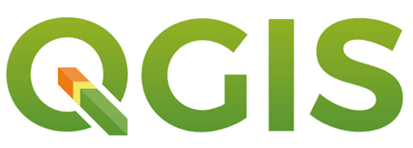

## Geospatial data 

Geospatial data is data about objects, events, or phenomena that have a location on the surface of the earth (Stoke and Guesgen, 2016). The location may be static in the short-term (e.g., the location of a road, an earthquake event, children living in poverty), long-term (e.g., city name, zip code, address), or dynamic (e.g., a moving vehicle or pedestrian, the spread of an infectious disease). Geospatial data combines location information (usually coordinates on the earth), attribute information (the characteristics of the object, event, or phenomena concerned), and often also temporal information (the time or life span at which the location and attributes exist).

## Geospatial data model
There are two main types of conceptualizations for digital geospatial data: the vector data model and the raster data model.

### Vector data

Vector data models use discrete elements such as points, lines, and polygons to represent the geometry of real-world entities (Figure 1. Vector data). Farm fields, roads, wetlands, cities, and census tracts are examples of entities that are often represented by discrete objects. Points are often used to define the locations of “small” objects such as wells, buildings, or ponds. Lines may be used to represent linear objects, for example, rivers or roads, or to identify the boundary between what is a part of the object and what is not a part of the object. We may map landcover for a region of interest, and we categorize discrete areas as a uniform landcover type. A forest may share an edge with a pasture, and this boundary is represented by lines. The boundaries between two polygons may not be discrete on the ground. For example, a forest edge may grade into a mix of trees and grass, then to pasture; however, in the vector conceptualization, a line between two landcover types will be drawn to indicate a discrete, abrupt transition. Lines and points have coordinate locations, but points have no dimension, and lines have no dimension perpendicular to their direction. Area features may be defined by a closed, connected set of lines.

Vector data
{: .text-center}

### Raster data

Raster data
{: .text-center}

### GIS software

A GIS is a tool for making and using spatial information. Among the many definitions of GIS, we choose: **A GIS is a computer-based system to aid in the collection, maintenance, storage, analysis, output, and distribution of spatial data and information.**

GIS are essential tools in business, government, education, and nonprofit organizations, and GIS use has become mandatory in many settings. GIS have been used to fight crime, protect endangered species, reduce pollution, cope with natural disasters, treat epidemics, and improve public health; in short, GIS have been instrumental in addressing some of our most pressing societal problems.

Using GIS to assist analyzing geospatial data, we need to implement the tool through GIS software. There are multiple types of [GIS software](https://mangomap.com/gis-software): GIS desktop, web GIS, and server GIS. GIS desktop is software you need to install on the device and run it. Web GIS uses web technology to communicate between a server and a client, where the server is a GIS server and the client is a web browser, desktop application, or [mobile application client] (https://enterprise.arcgis.com/en/server/latest/create-web-apps/windows/about-web-gis.htm). A Server GIS is used for creating and managing GIS Web services, applications, and data. We will the desktop GIS software, QGIS, to perform raster analysis tools to analyze raster data.  

### QGIS 

[QGIS](https://www.qgis.org/en/site/) is a free and open-source cross-platform desktop geographic information system application that supports viewing, editing, and analysis of geospatial data (Figure 3. QGIS). QGIS upgrades constantly due to dynamic community. QGIS can run in both Wins and Mac. You can refer to [QGIS download page](https://qgis.org/en/site/forusers/download.html) to download the latest version of GIS. 

QGIS
{: .text-center}


