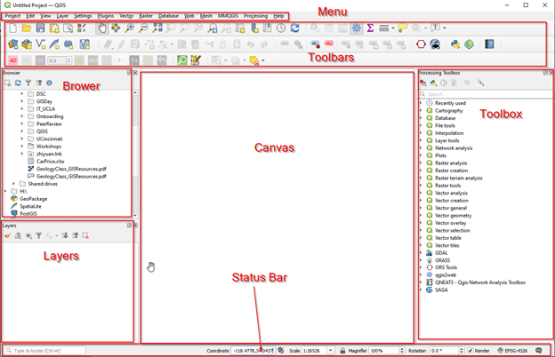
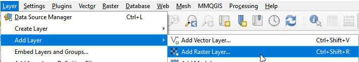
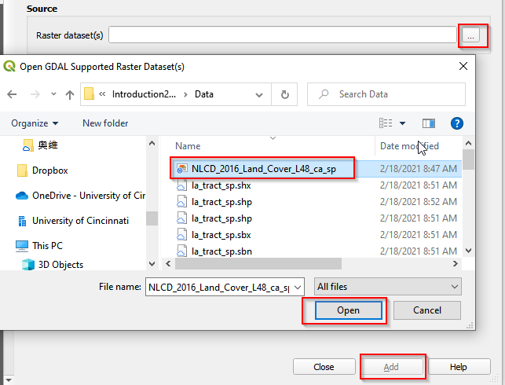
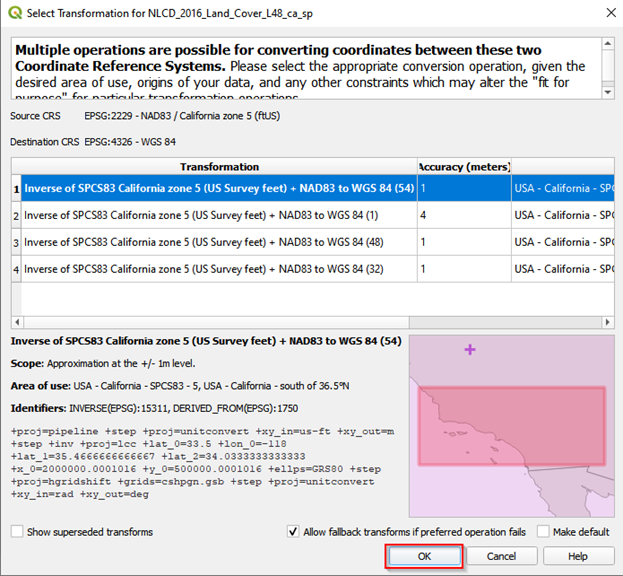
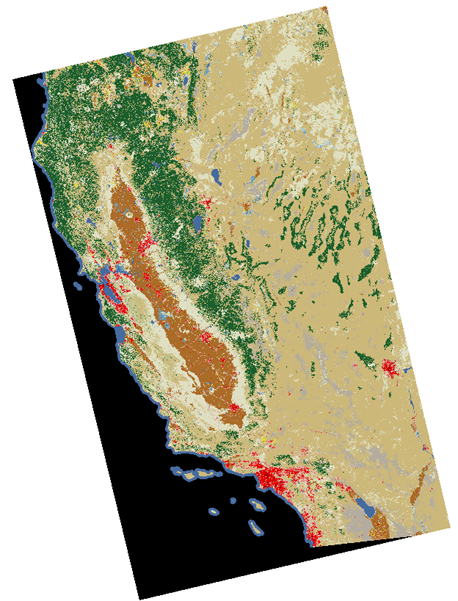
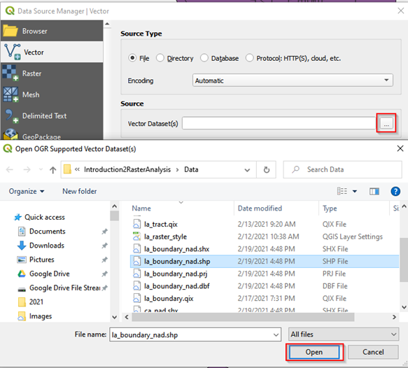
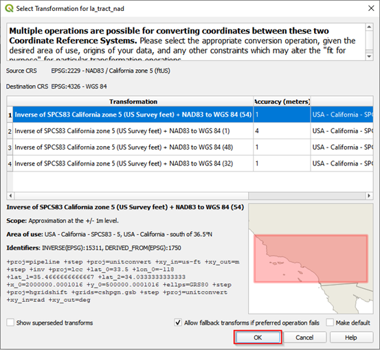
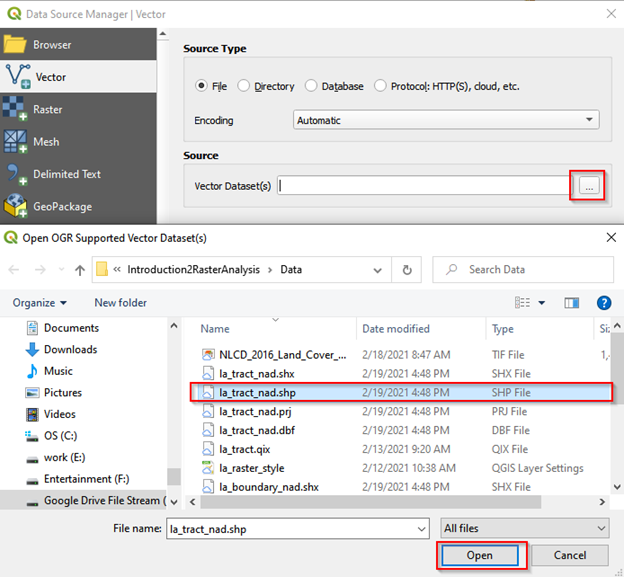
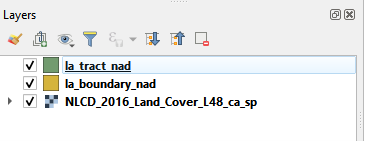

## QGIS Layout

**a.**	The main area of QGIS is called the canvas. There are also panels and toolbars, a status bar and menu panels.   
**b.**	Panels and toolbars may be moved around and docked at different locations (left-click and hold to initiate this flexibility).  If you drop a panel on top of another, they will be nested into tabs. Panels you do not used can be removed. Toolbars can be moved around in much the same way, but you cannot nest toolbars into tabs. By right-clicking in the toolbar area, you may get a list of available panels and toolbars you can turn them on and off as you like.
**c.**	Through the menu, you can access almost everything in QGIS; some functions have buttons, and keyboard shortcuts as well.
**d.**	The status bar shows relevant information about the current tool or aspects of the map canvas, like coordinates and scale.
**e.**	Toolbox is where you can search for all the tools provided in QGIS. If you can see the toolbox as the figure shows, you can open it in the menu (Processing->Toolbox)

QGIS layout
{: .text-center}

Use the map navigation toolbar to help navigate your map in the canvas. Here you can find tools to pan and zoom the map, zoom to selected features, and view the complete extent of the map or selected layer. You can also jump to a previous extent with dedicated buttons.  

QGIS toolbar
{: .text-center}

## Add raster data

To get started, let’s add raster data that we need to analyze in this workshop. 

**a.**	In the Menu, click Layer->Add Layer->Add Raster Layer. 

Add raster layer from Menu
{: .text-center}

**b.**	Navigate to the data folder and select NLCD_2016_Land_Cover_L48_ca_sp. 

Add raster layer
{: .text-center}

**c.**	After clicking Add, a window pops up informing the projection transformation. This window shows up as the projection of the added new layer is different from the default projection of QGIS. We want to use the projection of the added layer. Accept the default and click OK. 

Change projection
{: .text-center}

**d.**	The added raster layer should be like the following. 

Land cover raster layer
{: .text-center}

## Add vector data

Next step is to add vector data to QGIS. We have two vector layers: **la_boundary_nad.shp and la_tract_nad.shp**. 

**a.**	Click Layer->Add Layer->Add Vector Layer 

Add vector data from Menu
{: .text-center}

**b.**	In the Data Source Manager|Vector window, navigate the data folder and add **la_boundary_nad.shp**. 

Add vector data (1)
{: .text-center}

**c.**	After clicking Open, a new window pops up asking for projection transformation. It is the same as adding the raster layer. Accept the default and click OK. 

Change projection
{: .text-center}

**d.**	Following the same procedure and add another vector layer, **la_tract_nad.shp**. 

Add vector data (2)
{: .text-center}

After adding vector and raster layers, you should see there are three layers in the Layer panel. You can drag the layers up and down to reorder them. 

Layer panel
{: .text-center}


