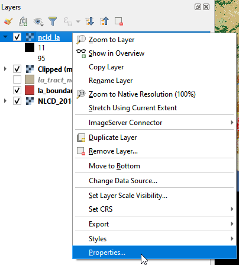

## Raster Analysis

We add all the data for the workshop. In the following, we will clip the raster to the Los Angeles extent, do raster calculations, extract the green space coverage statistics, and join the statistics to the added vector layer, **la_tract_nad.shp**. 

## Clip raster

The added raster layer, **NLCD_2016_Land_Cover_L48_ca_sp**, covers the whole California, while we are interested in the green space in Los Angeles County. We will clip the raster layer using the mask layer of Los Angeles County. 

**a.**	To clip the raster layer, go to Processing Toolbox (to open Processing Toolbox, Menu->Processing->Toolbox). In the searching bar, click Clip raster by mask layer. 

Clip raster by mask layer in Toolbox
{: .text-center}

**b.**	In the Clip Raster by Mask Layer
    i.	Input layer: NLCD_2016_LanD_Cover_L48_ca_sp
    ii.	Mask layer: la_boundary_nad
    iii.	Assign a specified nodata value to output bands: 0
    iv.	X Resolution to output bands: 30
    v.	Y Resolution to output bands: 30

Clip raster layer
{: .text-center}

**c.**	A new layer, Clipped (mask), shows up in the Layers panel. By the right side of the layer, a label informs this is a “Temporary Layer only! Contents will be discarded after closing QGIS.” 

Clipped layer
{: .text-center}

**d.**	As the layer will be discarded, we want to save this layer. Right click the Clipped (mask), Export, and Save as. 

Save the clipped layer
{: .text-center}

**e.**	Name the layer as ncld_la. Select the CRS as **EPSG: 2229 – NAD83 / California zone 5 (ftUS)**. Click OK.

Export the clipped layer
{: .text-center}

**f.**	The saved raster layer shows up in the Layer panel. The colors of the layer change as the Symbology changes. 

The saved raster layer
{: .text-center}

**g.**	Right click the ncld_la layer and click Properties. 

Layer properties
{: .text-center}

**h.**	In the new window, choose Symbology. Let’s change the symbology of the layer
    i.	Render type: Paletted/Unique values
    ii.	Classify 
    iii.	OK.

Layer symbology (1)
{: .text-center}

Layer symbology (2)
{: .text-center}

## Raster calculator

Raster data consists of grids and the attribute value associate with each grid. Raster calculator does the math-like operations with the attribute values of the grids. In this session, we will classify the green space and non-green space for **ncld_la layer**. The **ncld_la layer**, same as the NCLD 2016 data, has 20 types of land cover, among which 11 Open Water, 12 Perennial Ice/Snow, 23 Developed Medium Density, 24 Developed High Density, and 31 Barren Land are non-green space. We will apply Raster Calculator to assign a new value (1) to green space and another new value (0) to the non-green space. 	

**a.**	In the Processing Toolbox, type raster calculator in the searching bar. Choose Raster Calculator under Raster Analysis. 

Raster calculator in Processin Toolbox
{: .text-center}

**b.**	In the Raster Calculator window. Expression:
        ("ncld_la@1"  != 11 AND R "ncld_la@1"  != 12 AND ncld_la@1"  !=  23  AND "ncld_la@1"  !=  24  AND  "ncld_la@1"  !=  31 )  * 1
   
This expression means if the attribute values of grids are not 11, 12, 23, 24, or 31, we will assign 1 to these grids and assign 0 to the rest of the grids. After the calculator, we will have 2 attribute values (0 and 1) for the grids, 0 representing the non-green space area, while 1 representing the green space area. 

Raster Calculator (1)
{: .text-center}
**c.**	Cell size: 30. Output extent: click Calculate from Layer->la_boundary_nad. We want the output extent the same as the Los Angeles County. 

Output extent in Raster Calculator
{: .text-center}

**d.**	Output CRS:  Click the button to open Coordinate Reference System Selector. In the searching bar, type in 2229 and select the **NAD 83/ California zone 5 (ftUS)**. 

Raster Calculator (2)
{: .text-center}

**e.**	The output layer after Raster Calculator is also a Temporal Layer. We export and Save it as **ncld_la_greenspace.tiff**. 

Export the layer
{: .text-center}

Save the layer
{: .text-center}

**f.**	The saved layer will show up in the Layer Panel. 

The calculated layer in the Layer Panel
{: .text-center}

## Zonal statistics

We classified the land cover data into two categories: green space and non-green space. In the ncld_la_greenspace layer, the green space grids have the value 1, while the non-green space have the value 0. As we intend to investigate the coverage of green space in each census tract, we will do zonal statistics to summarize the statistics (e.g., sum, count, mean) of the land cover layer (ncld_la_greenspace) within the census tract layer (la_tract_nad.shp). 

**a.**	Go to the Processing Toolbox and type zonal statistics in the searching bar. Select Zonal Statistics. 

Zonal statistics in the Processing Toolbox
{: .text-center}

**b.**	In the Zonal Statistics window:
        i.	Raster layer: **ncld_la_greenspace [EPSG: 2229]**
        ii.	Vector layer containing zones: **la_tract_nad [EPSG: 2229]**
        iii.	Statistics to calculate: click the button to specify the statistics to summarize
        

Zonal statistics (1)
{: .text-center}

**c.**	Select Count, Sum, and Mean as the Parameters and click Run. 

Zonal statistics (2)
{: .text-center}

**d.**	Zonal Statistics summarizes the Count, Sum, and Mean and creates three columns in the census tract layer: **la_tract_nad**. Let’s open the attribute table of the la_tract_nad layer and check the new columns. Right click the layer->Open attribute table. 

Open the attribute table
{: .text-center}

**e.**	In the attribute table, there are three new added columns: “_count”, “_sum”, “_mean.” 

The attribute table
{: .text-center}

**f.**	The numbers in “_count” column are the count of grids in each census tract. The values in the “_sum” column are the sum of grids of green space as the values of grids of green space is 1 and values of grids of non-green space is 0. The “_mean” column shows the mean of grids of green space.  

The columns in the attribute table
{: .text-center}

## Calcualte the area and percentage of green space in census tract

In the above sections, we summarize the grids of green space. As the values of green space is 1 and the values of non-green space is 0. The sum of the grids is the total number of grids of green space. NLCD 2016 dataset’s resolution is 30m by 30m, and as a result the area of the green space can be calculated as **_sum*30m*30m**.  

As you noticed, there is a “Shape_Area” column in the attribute table. “Shape_Area” is the area of each census tract. What is the unit of the “Shape-Area”? We can find the information in the Properties of the layer, **la_tract_nad**. 

**a.**	Right click the layer, select Properties. You can find the Unit is feet from the Information. As the unit for the layer is feet, the unit of “Shape_Area” is square feet. 

Layer properties
{: .text-center}

**b.**	To make the unit consistent for the “Area” (the new created column) and the “Shape_Area”, we need to convert the unit when we calculate the “Area” of green space. The Area will be calculated as _sum*30*30*0.3048*0.3048 (1 meter = 0.3048 feet). The configurations are as the following:
        Output field name: **Area**
	    Output field type: **Decimal number (real)**
	    Output field: **length 10**; **Precision: 6** 
	    Expression: **“_sum”*30*30*0.3048*0.3048**
        

Add and calculate a new column: Area
{: .text-center}

**c.**	We can calculate the percentage of green space in each census through “Area”/”Shape_Area”. The configurations are as the following:
        Output field name: **greenspace**
		Output field type: **Decimal number (real)**
		Output field: **length 10**; **Precision: 6 **
		Expression: **“Area”/”Shape_Area”**
        

Add and calculate a new colulmn: greenspace
{: .text-center}

**d.**	Open the attribute table and check the two new created columns: “Area” and “greenspace”

Area and greenspace columns
{: .text-center}

**e.**	 Click the “pencil” button and save the editing.

Save edits
{: .text-center}

## Change Symbology

We calculated the percentage of green space as a new column ‘greenspace’ in the attribute table of the layer **la_tract_nad**. The session we will learn how to visualize this attribute and change the symbology of the layer. 
 
**a.**	Right click the layer and select Properties. 

Open Properties
{: .text-center}

**b.**	In the Layer Properties window, select Symbology from the left panel. 
**c.**	At the top of the right panel, select Graduated. 
        i.	Value: **greenspace**
        ii.	Color ramp: **green ramp**
        iii. Mode: **Natural Breaks (Jenks)**
**d.**	Click Classify. 

To classify the “greenspace” attribute, we select Natural Breaks (Jenks). This method makes the variance within each class minimized and the variance between classes maximized. QGIS also offers other methods of classification. You can choose other methods accordingly depending on what perspective you want to emphasize. 

•	Equal Count (Quantile): each class will have the same number of elements (the idea of a boxplot).
•	Equal Interval: each class will have the same size (e.g. with the values from 1 to 16 and four classes, each class will have a size of four).
•	Logarithmic scale: suitable for data with a wide range of values. Narrow classes for low values and wide classes for large values (e.g. for decimal numbers with range [0..100] and two classes, the first class will be from 0 to 10 and the second class from 10 to 100).
•	Natural Breaks (Jenks): the variance within each class is minimized while the variance between classes is maximized.
•	Pretty Breaks: computes a sequence of about n+1 equally spaced nice values which cover the range of the values in x. The values are chosen so that they are 1, 2 or 5 times a power of 10. (based on pretty from the R statistical environment https://www.rdocumentation.org/packages/base/topics/pretty).
•	Standard Deviation: classes are built depending on the standard deviation of the values.

Change Symbology
{: .text-center}

These procedures classified the attribute “greenspace” (the percentage of greenspace in each tract) into five groups with different colors. The darker the color is, the high the percentage is. Looking the layer, you can identify which area has a higher percentage of greenspace and which area has a lower percentage of greenspace. 


