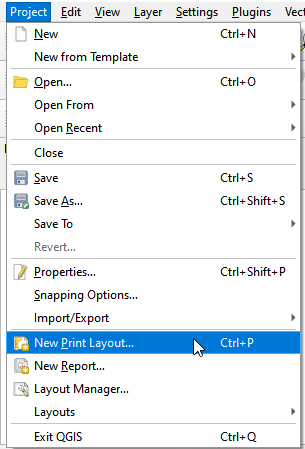
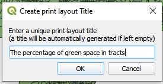
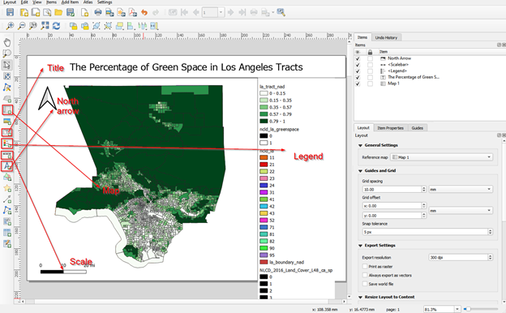
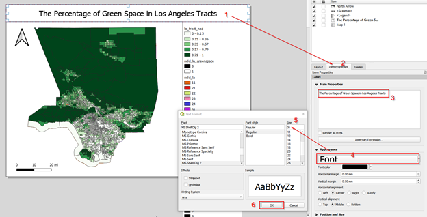
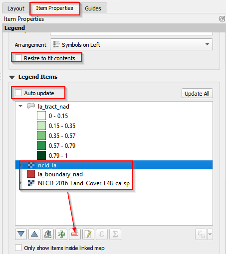
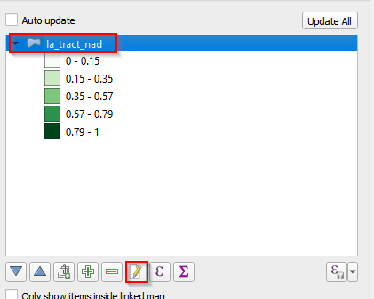
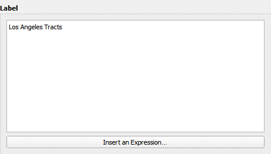
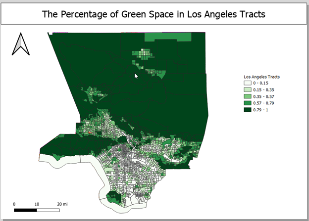
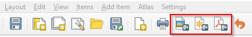

## Create a new print layout

Our final goal is to make a map and share the finding with other people. We will learn how to create a new layout, add map elements, and export the map.

**a.**	In Menu, click Project and then New Print Layout. 

**b.**	Name the new print layout as “The percentage of green space in tracts”. Click OK. 

## Map elements

Data frame, legend, north arrow, and scale are required elements of a map. Though title is not mandatory, it is recommended as it provides more information regarding the topic of the map. In the new print layout window, navigate to the left panel, and then click the buttons accordingly to add these map elements to the canvas. Net step is to change the properties of these elements and adjust the positions to a beautiful map.

**a.**	Change the properties of title 
    i.	Click the title
    ii.	Change the name of the title in the Item Properties tab
    iii.	Click the Font
    iv.	Change the size of title into 24 (you may select a different size to fit your map)
    v.	Click OK
    

**b.**	Change the properties of legend
    i.	Uncheck Resize to fit contents
    ii.	Uncheck Auto update
    iii.	Delete **ncla_nad**, **la_boundary_nad**, and **NLCD_2016_Land_Cover_L48_ca_sp** layers
    iv.	Change the name of the layer in legend (Figure 46 and Figure 47)

## Export and save a map



